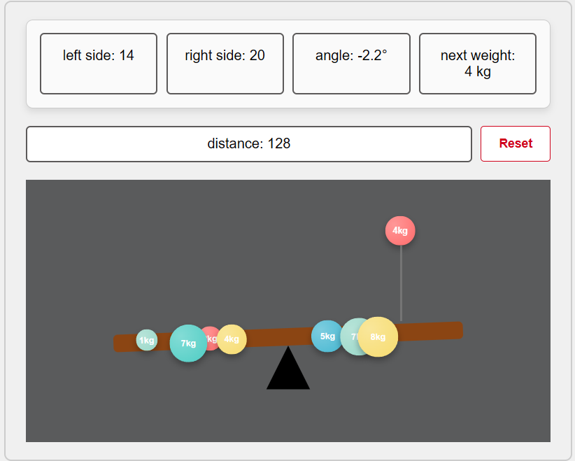

# Seesaw Project

https://oguzhanozil.github.io/seesaw-oguzhanozil/

First of all I start the project by planning. I want to start with
base HTML and CSS files. After that I start by doing base-html and base-css
files. I added my base elements first which are  Plank, basic score chart, triangle etc.

Then I started to implement the required functionalities one by one. Mouse-hover, creating the next random weight object, dropdown animation.  I started searching on the internet and I found some good usages.
After I have learnt, with a little bit of AI I prepared the animation.

The next step is the line between object and plank. After completing the implementation of the line, I implemented local storage logic so that the weight objects already fallen in to the plank is saved. After that I added a reset button. I took a break from the functionality and started to improve my CSS file. Then I came back to the functionality and implemented the angle of the plank functionality. I also added distance indicator which shows distance between the line 
(where the ball drops) and pivot point. I faced an obstacle, the weight objects were note dropping the exact location when the plank had an angle. I tried some CSS tricks but I could not find the right fix. After that I realised that width of plank component changes
with the angle. So if I divide the X coordinate that object going to be 
dropped to cosinus of current angle I can get the true location and put
object on it. I tried this and it worked.

Then I hit an issue that every frontend engineer has to think of, when resizing the window, the location of the elements in the view were changing. 
I fixed this issue with some CSS properties. As a last step I made some optimization and polished the UI.

The use of AI primarily involved CSS tasks, such as setting element locations (e.g., margin-left) and centering content. Additionally, AI provided minor assistance with animation development.

